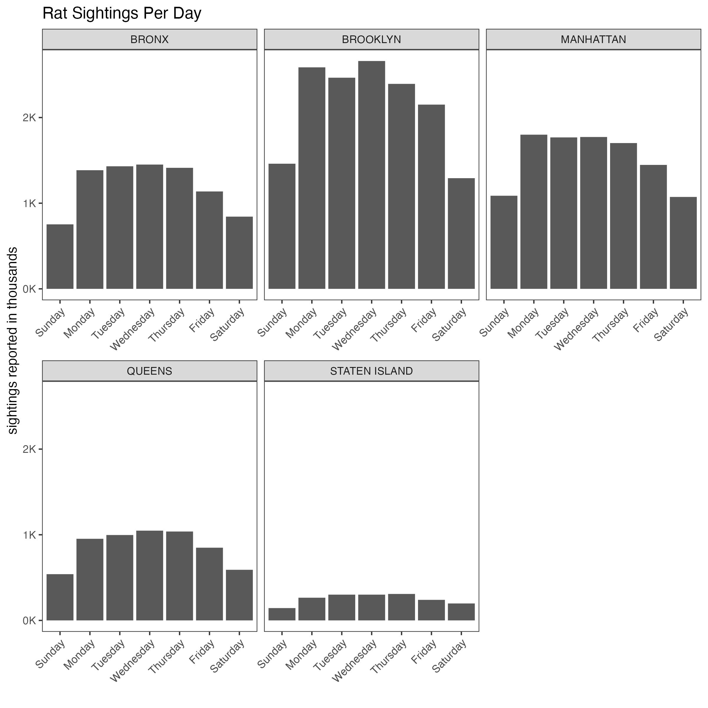

# Data Visualization and Reproducible Research

> Valentina Colorado 

You can learn more about me on my [GitHub profile page](https://github.com/ValColorado). 

The following is a sample of products created during the _"Data Visualization and Reproducible Research"_ course.

## Project 01

In the `project_01/` folder, you can find an analysis of rat sightings in New York City from 2015 - 2017

**Sample data visualization:** 

## Project 02

In this project, I explored how American runners did in the 2017 Boston Marathon. Find the code and report in the `project_02/` folder.

**Sample data visualization:** 

_[include your favorite visualization from this project here]_

(you can place your figures in the `figures/` folder and use the `` option to add the pictures here)

## Project 03

In this project, I explored ... _[short description of the data visualizations you for this part of the project produced goes here]_

**Sample data visualization:** 

_[include your favorite visualization from this project here]_

### Moving Forward

_Please add here a short reflection on what you learned and what you plan to continue exploring in terms of data visualization, data storytelling, reproducible research, and/or related topics._
