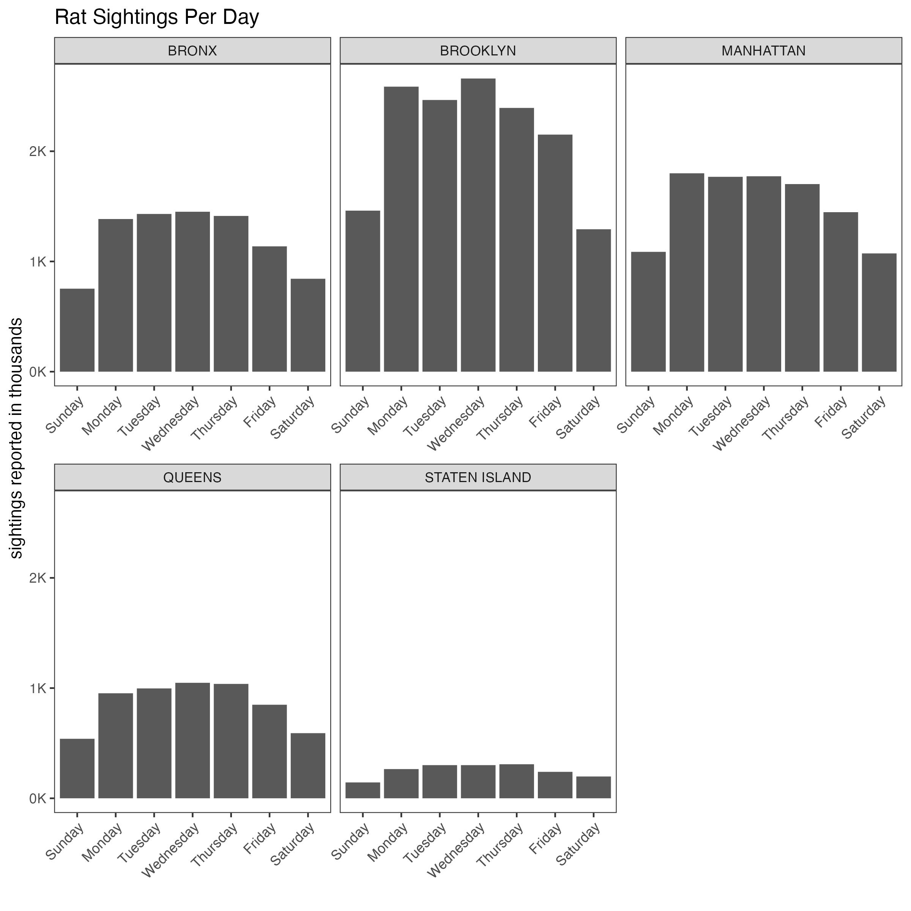
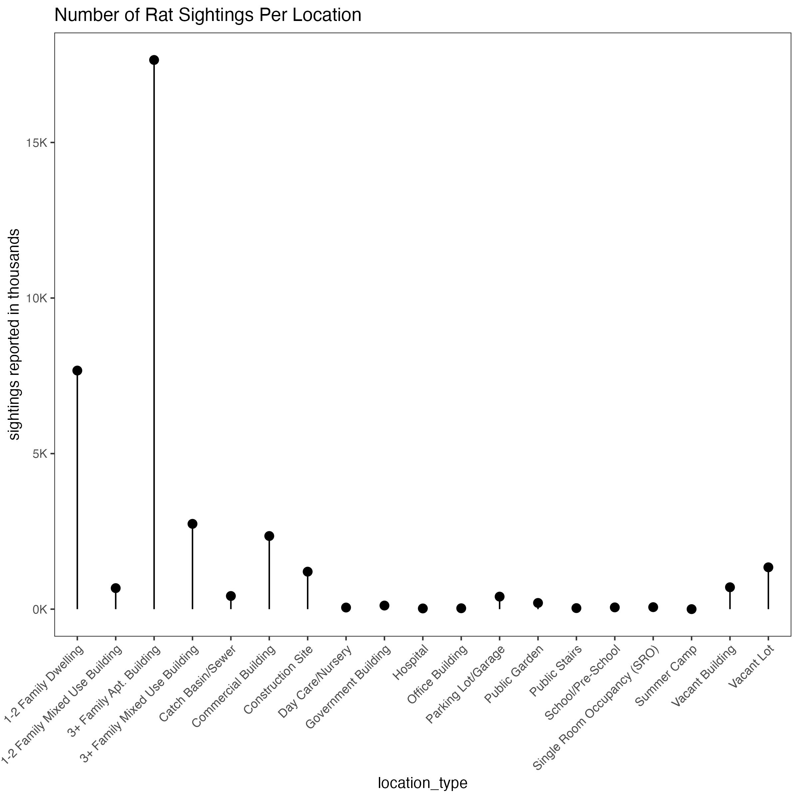
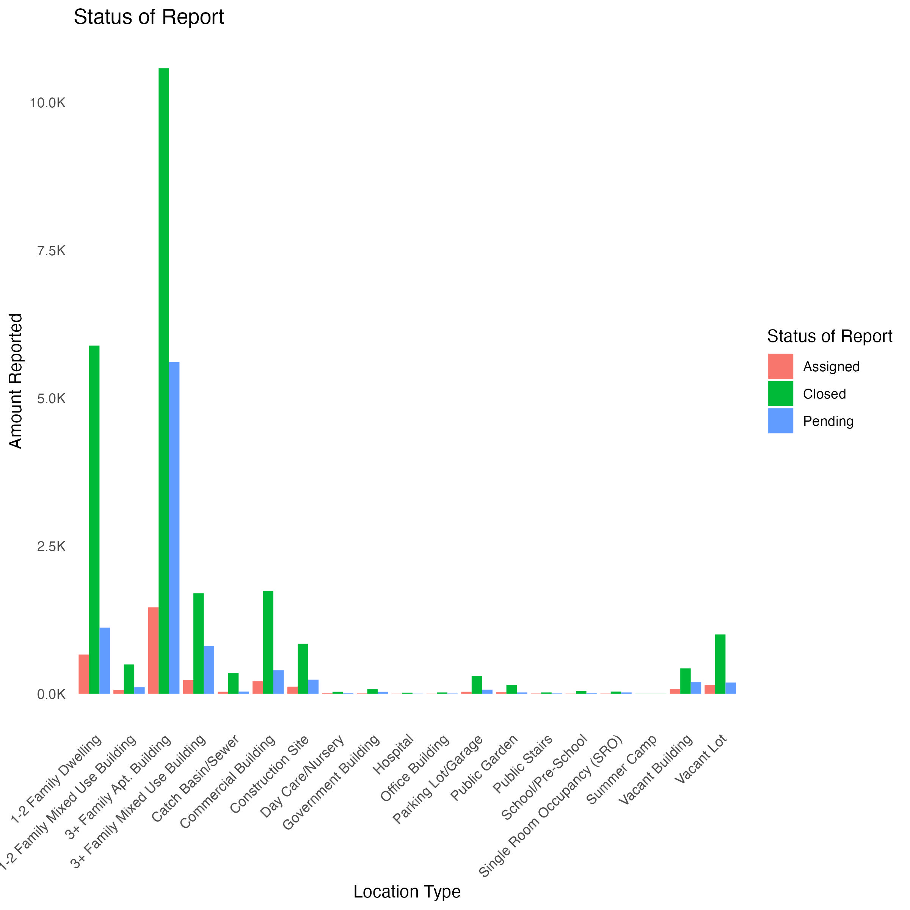

# Data Visualization Project 01: Rat Sightings NYC 2015-2017

## Dataset Overview

This project is to understand rat sightings in New York better. Originally I wanted to work on data from the world cup matches dataset, but I needed more information to give a good data analysis. Instead, I chose to go with the rats_nyc dataset. You can gather so much information from all the rat sightings reported in NYC from 2015 to 2017. The dataset includes the location of the rat sighting, the date/time it was recorded, if the issues were closed, and much more. I enjoyed going through this dataset because I never want to move to New York, the rat report helps remind me why I will never live there.

## Rat Sightings Per Day

First, I wanted to see which boroughs had the most rat sightings. To better visualize this (figure1.1), I used the `facet_wrap` function to give the reader a better breakdown of all the boroughs and the number of daily sightings.

{width="420"}

I was able to learn more on how to scale my x and y labels so no information is cut off.

## Rat Sighting Locations

After seeing the amount of sightings per the bouroughs I wanted to show how many many of those affected "family" buildings (figure 2.2).

{width="420"}

To visualize this, I used a "lollipop" chart to give the reader a sense of how many reports were from family buildings.

{width="420"}

Since most were residential locations, I used a grouped bar chart to see if the status of those rat sightings was closed or still pending figure 1.3. Although there were a lot of reports, it was nice to see that most of them were "closed."

## Key Takeaways

The story from my plots showed a slightly disturbing story of how many rat sightings there are in NYC. Most of them come from Brooklyn and are mainly reported in residential buildings. This dataset is outdated, so some of the reports that were still pending could have been closed. I've learned a lot about data visualizations over the past few weeks, and I followed the advice from the videos I watched. "The Glamour of Graphics" was one of the most informative on how visualizations should be structured, and I tried to implement some of his tips. I tried to follow his advice on grid lines and title placement. The principles of data visualization and design, from Gestalt Principles, I used similarity to ensure I grouped related objects like the location and amount of rats reported. I also built upon the other graphs I made previously to ensure some connection and close proximity.
