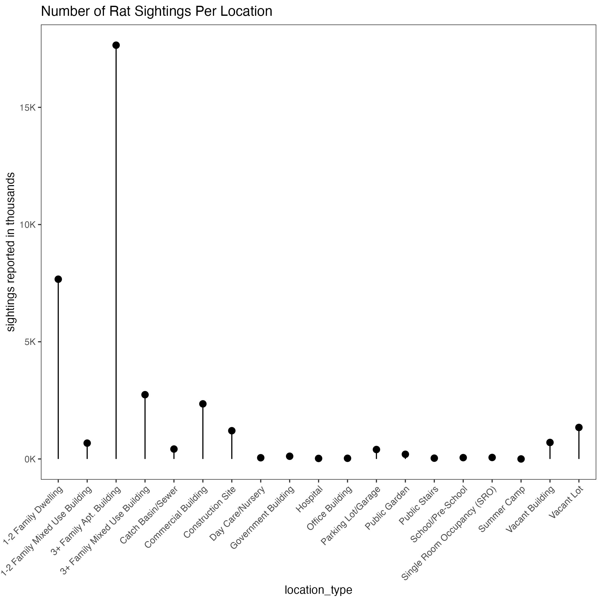
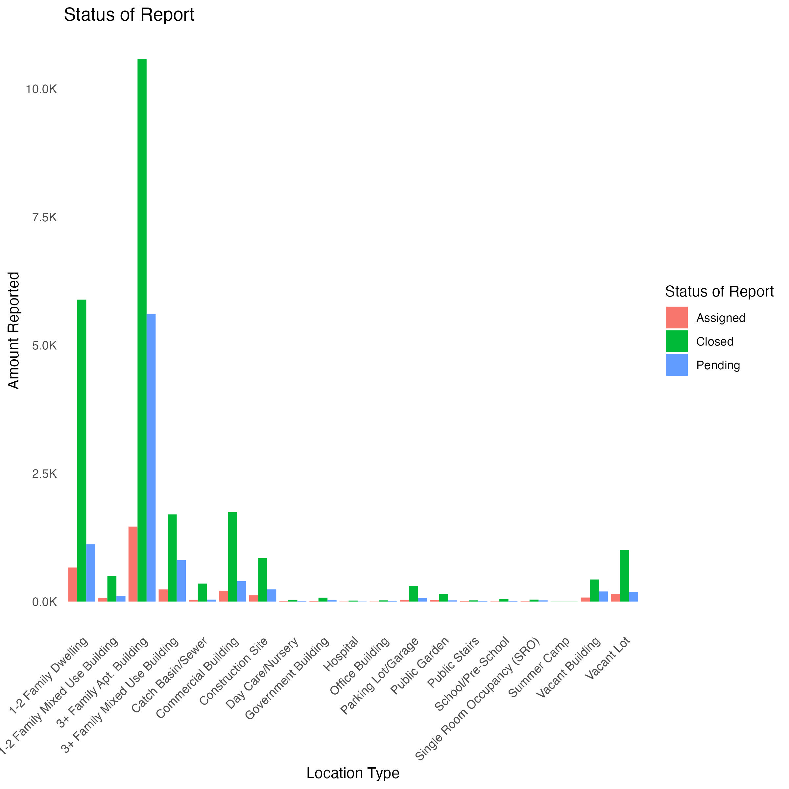

# Data Visualization Project 01: Rat Sightings NYC 2015-2017


## Dataset Overview

This project is to understand rat sightings in New York better. Originally I wanted to work on data from the world cup matches dataset, but I needed more information to give a good data analysis. Instead, I chose to go with the rats_nyc dataset. You can gather so much information from all the rat sightings reported in NYC from 2015 to 2017. The dataset includes the location of the rat sighting, the date/time it was recorded, if the issues were closed, and much more. I enjoyed going through this dataset because I never want to move to New York, the rat report helps remind me why I will never live there.

## Rat Sightings Per Day


### Data Exploration 
Now that we've downloaded the data we can start data exploration! 


```r
new_file_path <- "../data/rats_nyc.csv"
```

```r
rats <- read_csv(new_file_path)
```

To make it easier to maniuplate the sightings weekday column I am going to convert created_date that's already type of <S3: POSIXct> into a weekday by using the function wday from the `lubridate` package and then I'll save it into the sighting weekday column

```r
rats$sighting_weekday <-wday(rats$created_date,label = T, abbr = F)
```

```r
rats %>% 
  group_by(sighting_weekday, borough) %>% 
  count() %>% 
  arrange(desc(n))
```
which day of the week has the most rat sightings

```r
dotw <- rats %>% 
  group_by(sighting_weekday,borough) %>% 
  count() %>% 
  na.omit() %>% 
  arrange(desc(n))
```


```r
rat_borough <- ggplot(data = dotw, mapping = aes(x= sighting_weekday, y=n))+
  geom_col()+
  facet_wrap(~ borough, scales = "free_x")+
  labs(title = "Rat Sightings Per Day")+
  ylab("sightings reported in thousands")+
  xlab("")+
  scale_y_continuous(labels = label_number(suffix = "K", scale = 1e-3))+
   theme_bw()+
  theme(axis.title.x = element_text(hjust = 0),axis.text.x = element_text(angle = 45, hjust = 1), panel.grid =  element_blank())
 
```

Now that we have seperated the rat sightings out for each day of the week. I wanted to see which boroughs had the most rat sightings. To better visualize this I was used the `facet_wrap` function to give the reader a better breakdown of all the boroughs and the number of daily sightings. Figure 1.1 shows the results 


I was able to learn more on how to scale my x and y labels so no information is cut off. I also learned that its important to have the weekdays in order to better show off the information.

## Rat Sighting Locations

After seeing the amount of sightings per the boroughs I wanted to show how many many of those affected "family" buildings (figure 1.2).
Just taking a quick look at the data I see a lot of the reports come from "family buildings" how much sightings were reported per location 

```r
location_rat <- rats %>% 
   filter(location_type != "Other (Explain Below)") %>% 
  group_by(location_type) %>% 
  count() %>% 
  na.omit()

```

Using the `geom_pointrange` function I made a "lollipop" chart to better visualize the amount of reports that came from family buildings.

```r
rat_lollipop <-ggplot(data =location_rat, mapping = aes(x=
location_type, y= n))+
   geom_pointrange(aes(ymin=0, ymax=n))+
  labs(title = "Number of Rat Sightings Per Location")+
  ylab("sightings reported in thousands")+
  scale_y_continuous(labels = label_number(suffix = "K", scale = 1e-3))+
  theme_bw()+
  theme(axis.text.x = element_text(angle = 45, hjust = 1), panel.grid =  element_blank())
```





## Status of Report 

Since most were residential locations, I used a grouped bar chart to see if the status of those rat sightings was closed or still pending 

```r
location_rat <-rats %>% 
  group_by(location_type,status) %>% 
  filter(location_type != "Other (Explain Below)") %>% 
  count() %>% 
  na.omit()
location_rat
```
I want a better overall view of the data and since there isn't any explaination for the "other" locations I removed them 

```r
rats_status <- ggplot(data =location_rat, mapping =aes(x = location_type, y = n, fill = status)) +
  geom_bar(stat = "identity", position = "dodge") +
  labs(x = "Location Type", y = "Amount Reported", fill = "Status of Report") +
  ggtitle("Status of Report ") +
  scale_y_continuous(labels = label_number(suffix = "K", scale = 1e-3))+
  theme_minimal()+
  theme(axis.text.x = element_text(angle = 45, hjust = 1), panel.grid =  element_blank())
```

Figure 1.3 shows that although there were a lot of reports the majority of them have been closed! 


## Key Takeaways

The story from my plots showed a slightly disturbing story of how many rat sightings there are in NYC. Most of them come from Brooklyn and are mainly reported in residential buildings. This dataset is outdated, so some of the reports that were still pending could have been closed. I've learned a lot about data visualizations over the past few weeks, and I followed the advice from the videos I watched. "The Glamour of Graphics" was one of the most informative on how visualizations should be structured, and I tried to implement some of his tips. I tried to follow his advice on grid lines and title placement. The principles of data visualization and design, from Gestalt Principles, I used similarity to ensure I grouped related objects like the location and amount of rats reported. I also built upon the other graphs I made previously to ensure some connection and close proximity.
