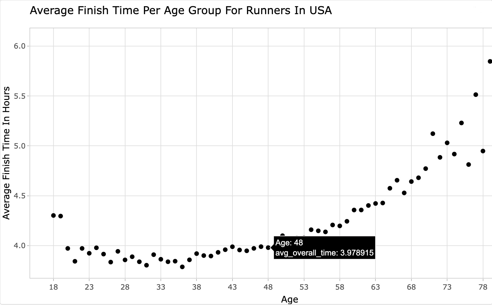
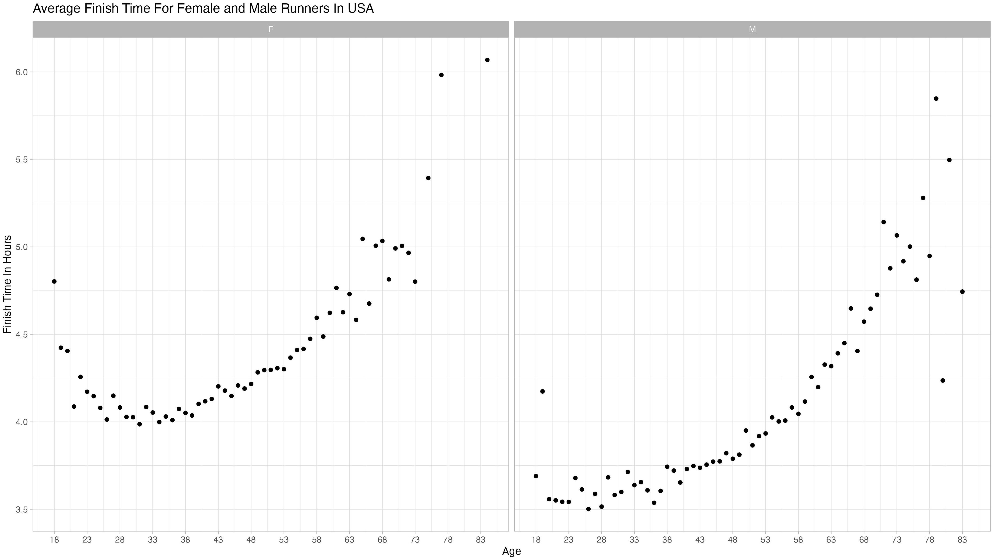
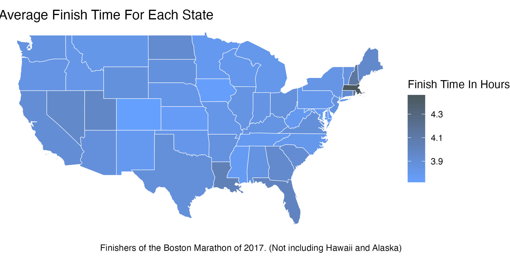
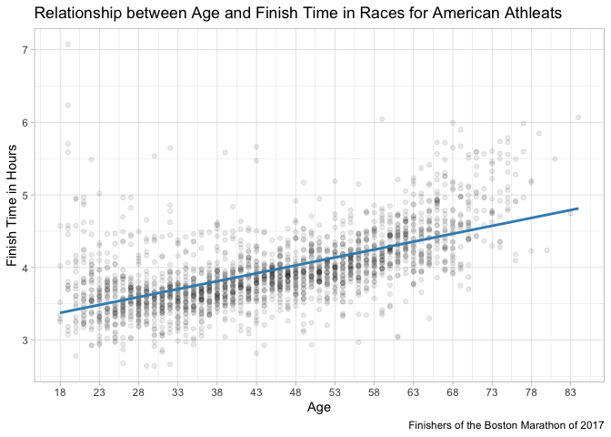

# Data Visualization Project 02: Finishers of the Boston Marathon of 2017

**Here we go!** 🏃💨


# Data Wrangling

``` r
# Load required libraries
library(ggplot2)
library(tidyverse)
library(ggthemes)
library(plotly)
```

``` r
# Read the CSV file
race <- read_csv("https://raw.githubusercontent.com/reisanar/datasets/master/marathon_results_2017.csv")
```

``` r
race
```

```         
## # A tibble: 26,410 × 22
##    Bib   Name    Age `M/F` City  State Country `5K`   `10K` `15K` `20K` Half    
##    <chr> <chr> <dbl> <chr> <chr> <chr> <chr>   <time> <chr> <chr> <chr> <time>  
##  1 11    Kiru…    24 M     Keri… <NA>  KEN     15'25" 0:30… 0:45… 1:01… 01:04:35
##  2 17    Rupp…    30 M     Port… OR    USA     15'24" 0:30… 0:45… 1:01… 01:04:35
##  3 23    Osak…    25 M     Mach… <NA>  JPN     15'25" 0:30… 0:45… 1:01… 01:04:36
##  4 21    Biwo…    32 M     Mamm… CA    USA     15'25" 0:30… 0:45… 1:01… 01:04:45
##  5 9     Cheb…    31 M     Mara… <NA>  KEN     15'25" 0:30… 0:45… 1:01… 01:04:35
##  6 15    Abdi…    40 M     Phoe… AZ    USA     15'25" 0:30… 0:45… 1:01… 01:04:35
##  7 63    Maiy…    33 M     Colo… CO    USA     15'25" 0:30… 0:45… 1:01… 01:04:36
##  8 7     Sefi…    28 M     Addi… <NA>  ETH     15'24" 0:30… 0:46… 1:02… 01:06:04
##  9 18    Pusk…    27 M     Euge… OR    USA     15'24" 0:30… 0:45… 1:01… 01:04:53
## 10 20    Ward…    28 M     Kays… UT    USA     15'25" 0:30… 0:45… 1:01… 01:04:53
## # … with 26,400 more rows, and 10 more variables: `25K` <time>, `30K` <time>,
## #   `35K` <time>, `40K` <time>, Pace <time>, `Proj Time` <chr>,
## #   `Official Time` <time>, Overall <dbl>, Gender <dbl>, Division <dbl>
```

``` r
 race <- race %>% 
  filter(Country =="USA")  %>% 
  na.omit()
```

``` r
race <- subset(race, !(State %in% c("AA", "AE","AP","MH","GU","PR","VI","DC")))
```

``` r
colnames(race) <- gsub("\\s", "_", colnames(race))
```

``` r
race <- rename(race, genders = `M/F`)
```

``` r
avg_time <-race %>% 
  group_by(Age) %>% 
  summarise(avg_overall_time = mean(as.numeric(Official_Time), na.rm = TRUE),
            avg_overall_time = avg_overall_time/3600) 

avg_time
```

```         
## # A tibble: 66 × 2
##      Age avg_overall_time
##    <dbl>            <dbl>
##  1    18             4.30
##  2    19             4.30
##  3    20             3.97
##  4    21             3.84
##  5    22             3.97
##  6    23             3.92
##  7    24             3.98
##  8    25             3.91
##  9    26             3.83
## 10    27             3.94
## # … with 56 more rows
```

Here is where I group by age and find the average overall time for each age group.

``` r
avg_time_plot<-
  ggplot(data = avg_time) +
  geom_point(aes(x = Age, y = avg_overall_time,text = row.names(avg_overall_time))) +
  scale_x_continuous(limits = c(18, NA), breaks = seq(18, max(avg_time$Age), by = 5)) +
  labs(x = "Age", y = "Average Finish Time In Hours", title = "Average Finish Time Per Age Group For Runners In USA")+  
  theme(axis.text.x = element_text(angle = 25, hjust = 1))+
  theme_light()
```

``` r
avg_time_plot <- ggplotly(avg_time_plot)
```

``` r
#htmlwidgets::saveWidget(avg_time_plot, "fancy_plot_avg_time_plot.html")
```

``` r
#ggsave("final.jpg", plot = avg_time_plot, width = 20, height = 9, dpi = 300)
```



Here we can see that 28-38 year olds typically have the quickest marathon race times. It was interesting to see the 84 year old finisher! I can't imagine running for 6 hours a 25 year old.

After seeing this breakdown I wanted to see how different the average finish times were for males and females

``` r
avg_time_gender <- race %>% 
  group_by(Age,genders) %>% 
  summarise(avg_overall_time = mean(as.numeric(Official_Time), na.rm = TRUE),
            avg_overall_time = avg_overall_time/3600,
)
```

``` r
avg_time_gender_plot <- ggplot(data = avg_time_gender) +
  geom_point(aes(x = Age, y = avg_overall_time,fill=genders)) +
  facet_wrap(~ genders, ncol = 2) +  # Adjust the ncol parameter
  scale_x_continuous(limits = c(18, NA), breaks = seq(18, max(avg_time$Age), by = 5)) +
  labs(label = FALSE,x = "Age", y = "Finish Time In Hours", title = "Average Finish Time For Female and Male Runners In USA") +
  theme(axis.text.x = element_text(angle = 45, hjust = 1), 
        axis.title.x = element_text(margin = margin(t = 10, unit = "pt")),legend.position = "none")+
  theme_light()+
    scale_fill_manual(values = c("#FF00FF", "#4169E1"))  # Specify your desired fill colors
```

``` r
ggplotly(avg_time_gender_plot)%>%
  layout(width = 950)  # Adjust the width value
```

``` r
#ggsave("plot_gender_new.jpg", plot = avg_time_gender_plot, width = 15, height = 8, dpi = 300, type = "cairo")
```



This graph better visualizes the average finish time for males and females. It was interesting to see the majority of men finish under 4 hours between the age of 18-53 while most females average just over 4 hours

``` r
library(sf)
```

``` r
# Load world shapefile from Natural Earth
# https://www.naturalearthdata.com/downloads/110m-cultural-vectors/
world_shapes <- read_sf("spatial-data/ne_50m_admin_1_states_provinces/ne_50m_admin_1_states_provinces.shp")
```

Since `world_shapes` and `race` both have state names abbreviated i will rename state to match postal so i am able to join the tables

``` r
race <- rename(race, postal = `State`)
```

There are other countries listed I just want to focus on the avg run time per state in the USA

``` r
avg_state <- race %>% 
  filter(Country =="USA")  %>% 
  group_by(postal) %>% 
  summarise(avg_overall_time = mean(as.numeric(Official_Time), na.rm = TRUE),
            avg_overall_time = avg_overall_time/3600,
) %>% 
  na.omit()
```

``` r
avg_state %>% 
  arrange()
```

```         
## # A tibble: 50 × 2
##    postal avg_overall_time
##    <chr>             <dbl>
##  1 AK                 3.42
##  2 AL                 3.85
##  3 AR                 3.86
##  4 AZ                 3.88
##  5 CA                 3.90
##  6 CO                 3.72
##  7 CT                 3.93
##  8 DE                 3.76
##  9 FL                 4.00
## 10 GA                 3.94
## # … with 40 more rows
```

Leaving out american territories and military bases

``` r
avg_state <- subset(avg_state, !(postal %in% c("AA", "AE","AP","MH","GU","PR","VI","DC","AK")))
```

Changing the shapes dataset to only have USA

``` r
usa_shapes <- world_shapes %>% 
  filter(admin =="United States of America")
```

``` r
#join the two 
usa_shapes<-usa_shapes %>% 
  left_join(avg_state, by="postal")
```

``` r
usa_shapes <- usa_shapes %>% 
  select(postal,avg_overall_time)  %>% 
  na.omit()
```

This map shows the average finish time for each state. It showed Alaska as the state with the quickest time.

``` r
map_interactive <- ggplot() +
  geom_sf(data = usa_shapes, aes(fill = avg_overall_time, text = paste("State: ", postal)),
          color = "white") +
  scale_fill_gradient(low = "#66a0ff", high = "#4b595e") +
  labs(title = "Average Finish Time For Each State", fill = "Finish Time In Hours", caption = "Finishers of the Boston Marathon of 2017") +
  theme(legend.position = "bottom") +
  theme_void() 
```

``` r
ggplotly(map_interactive)
```

``` r
ggsave("map_interactive.jpg", plot = map_interactive, width = 8, height = 8, dpi = 300)
```



This map shows how the average finishing time for each state. I wanted an interactive map so when you hovered over each state you know what state it is plus that's specific's state average finish time. This dataset was from the Boston Marathon I was kind of surprised Massachusetts didn't have a quicker finish time. It was interesting to see how people from Alaska had the quickest average.

``` r
race_usa <- race %>% 
  filter(Country =="USA")  %>% 
  group_by(postal,Age) %>% 
  summarise(avg_overall_time = mean(as.numeric(Official_Time), na.rm = TRUE),
            avg_overall_time = avg_overall_time/3600,
) %>% 
  na.omit()
```

``` r
race_usa <- subset(race_usa, !(postal %in% c("AA", "AE","AP","MH","GU","PR","VI","DC")))
race_usa
```

```         
## # A tibble: 2,151 × 3
## # Groups:   postal [50]
##    postal   Age avg_overall_time
##    <chr>  <dbl>            <dbl>
##  1 AK        24             3.20
##  2 AK        26             2.68
##  3 AK        27             3.50
##  4 AK        28             3.34
##  5 AK        29             3.70
##  6 AK        30             2.64
##  7 AK        31             2.86
##  8 AK        32             2.67
##  9 AK        35             3.37
## 10 AK        36             3.11
## # … with 2,141 more rows
```

``` r
race_model <-ggplot(race_usa, aes(x = Age, y = avg_overall_time)) +
  geom_point(alpha = 0.09) +
  geom_smooth(method = "lm", se = FALSE, color = "#3B8DBD") +
  scale_x_continuous(limits = c(18, NA), breaks = seq(18, max(avg_time$Age), by = 5)) +
  labs(title = "Relationship between Age and Finish Time in Races for American Athleats", y = "Finish Time in Hours", caption = "Finishers of the Boston Marathon of 2017") +
  theme(
    plot.title = element_text(hjust = -.5, family = "Arial", face = "bold", size = 12),
    axis.title.y = element_text(family = "Arial",  size = 12),
    axis.title.x = element_text(family = "Arial", size = 12,margin = margin(t = 10, unit = "pt"))
    )+
theme_light()
```

``` r
race_model
```

```         
## `geom_smooth()` using formula = 'y ~ x'
```

``` r
#ggsave("race_model.png", plot = race_model, dpi = 300)
```



Since my earlier visualizations focused on age and race time, I decided to model the relationship between age and race time for American racers. Since I learned more about colors I changed the default blue to the official blue Boston color `#3B8DBD`
