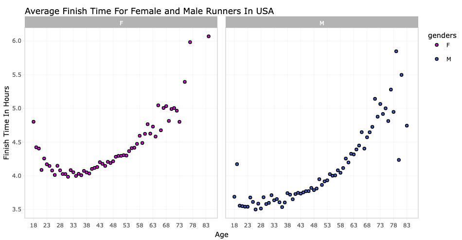
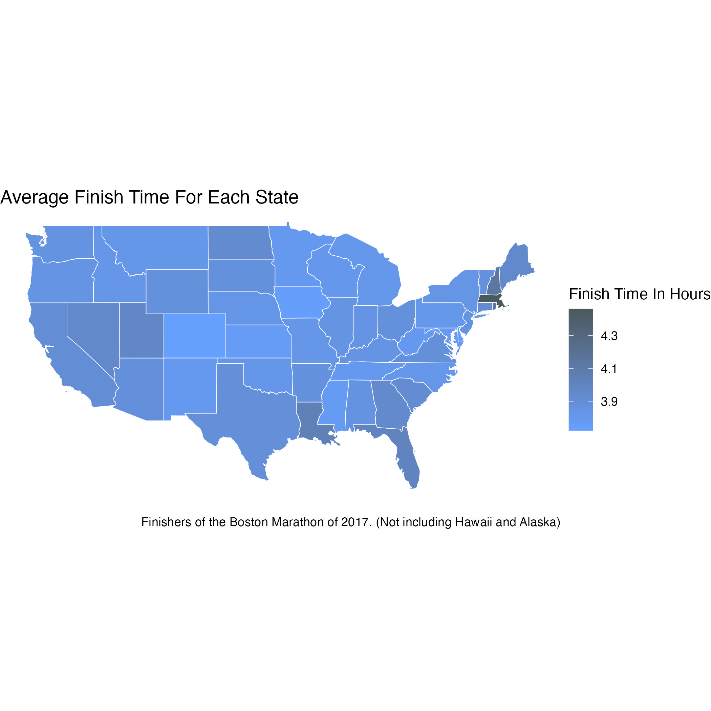

# Data Visualization Project 02

# Mini-Project 2: Finishers of the Boston Marathon of 2017

> Valentina Colorado.

**Here we go! 🏃💨**

## **Interactive plots**

Mini project 2 I decided to go with a dataset with information on the Boston Marathon finishers in 2017. I enjoyed going through this dataset because I was able to focus on the age, gender, and overall finish time of the racers. Before starting any data visualization, I needed to do some data wrangling. I noticed that a space separated some of the column names. This made it harder to analyze them, so I subbed the spaces for "\_." This made it easier to reference them while doing data analysis. I also renamed the column"M/F" to genders because the "/" also made it hard to reference. After I did my data wrangling, I decided to focus on seeing how on average, all the different age groups performed. To make all the maps more cohesive, I only used racers that were from the USA.

It was interesting to see how the time changed as the age increased, which I expected. Although I thought the 18-23-year-old age group would have the quicker finish times. After making this chart, I wanted to see if there was a big difference between males and females regarding their age and finish times.

Something I learned this semester was `facet_wrap` using this made it easier to lay the two graphs side by side. This gives the reader an easier-to-interpret visualization of the difference between the two genders. It's hard to see the way it saved, but on the left is the female average, and on the right is the male. For some reason, when I saved the image, it also got rid of the colors I set.

In making these two graphs, I found that setting up the labels and the theme was the hardest part. I'm not sure why but sometimes, when I tried to change the theme, all the labels would get messed up, or it wouldn't change.

## **Spatial visualization**

With mini project 2, spatial visualization was the hardest for me. At first, I was going to use the package `ggmap`, but it requires an account with Google that you have to pay for. It gives you \$300 in credit but requires you to put a card down. I didn't like that idea, so I used the shapefiles from a previous assignment to map the run times. Once I figured out the shape files, everything else wasn't too difficult. Originally I wanted to do the average time for each country, but I pivoted once I realized the shape file and the marathon dataset both had the states abbreviation.

## **Visualization of a model**

Finally, my last visualization was the easiest one to make. The difficult part was figuring out what values would make a good model. Since my earlier visualizations focused on age and race time, I decided to model the relationship between age and race time for American racers.

## **Applying the principles of data visualizations and design**

Overall, I'm happy with the way my notebook came out, and I was able to use a lot of the principles I've learned so far about data visualizations. For example, I made most of my maps interactive by using the `plotly` package. This gives the reader more context on what they are looking at once they hover over an observation. I also used themes in all my charts. After looking through all of them, I choose a minimal theme so the reader wasn't distracted when looking at the plots. Colors were used in some of my plots. For the breakdown of genders, I looked into shades of pink and blue that would look better together. In the spatial visualization map, I looked for colors that complimented each other well for the gradient. Finally, for the model visualization, I used Boston's [official blue](https://www.colorcombos.com/colors/3B8DBD) they use for boston `#3B8DBD`!

**We've reached the finish line of mini project 2!**

