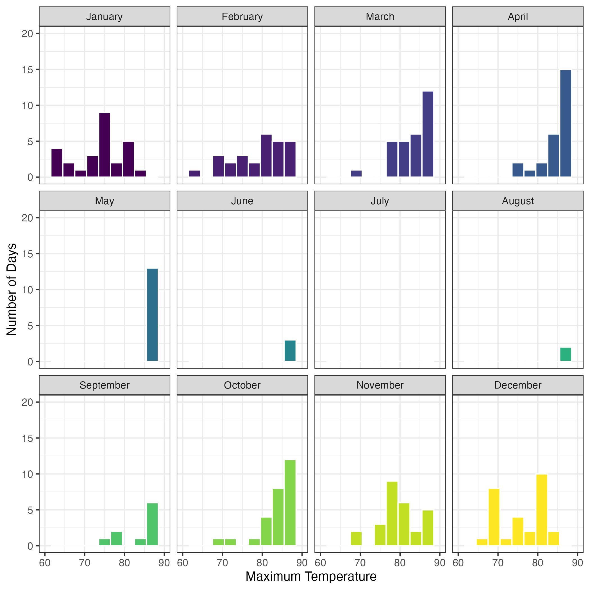
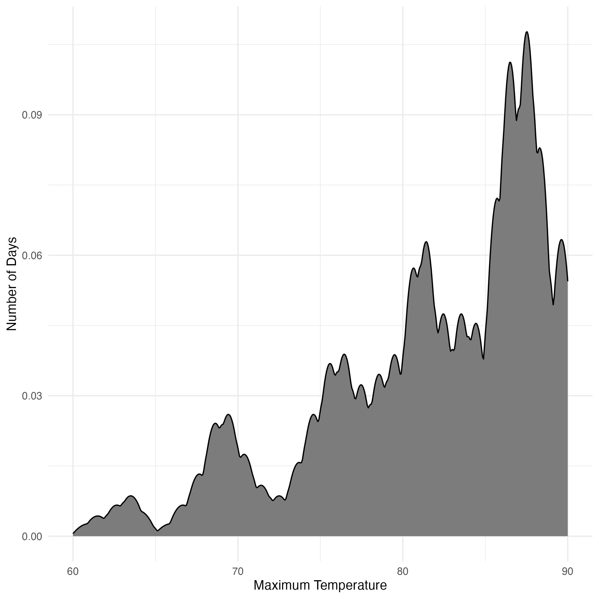
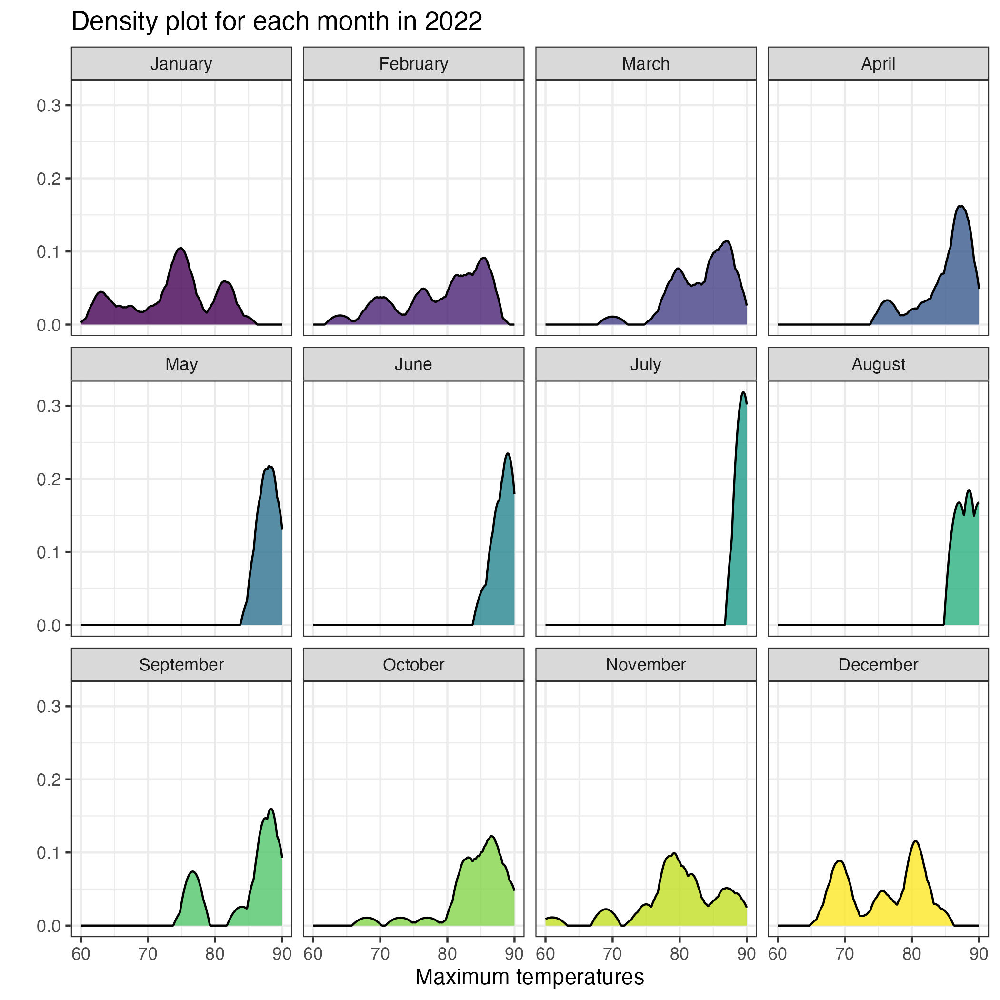
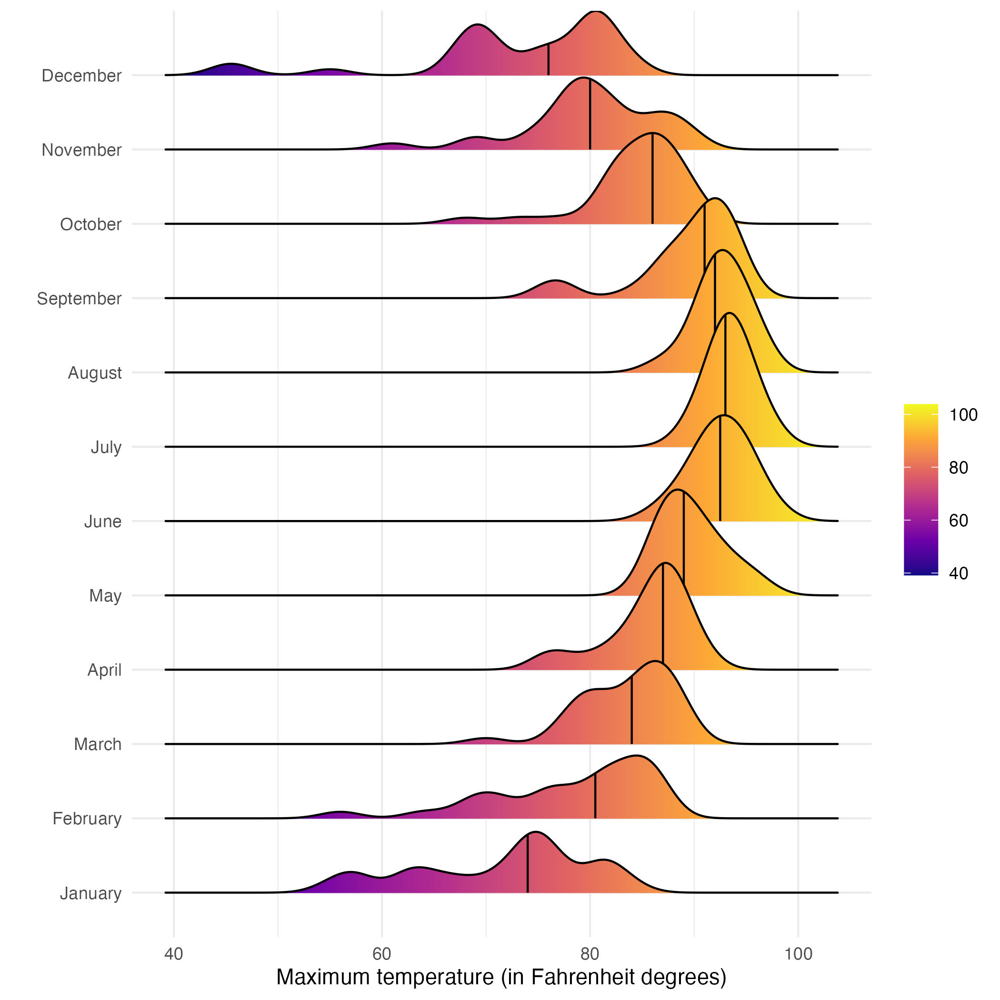
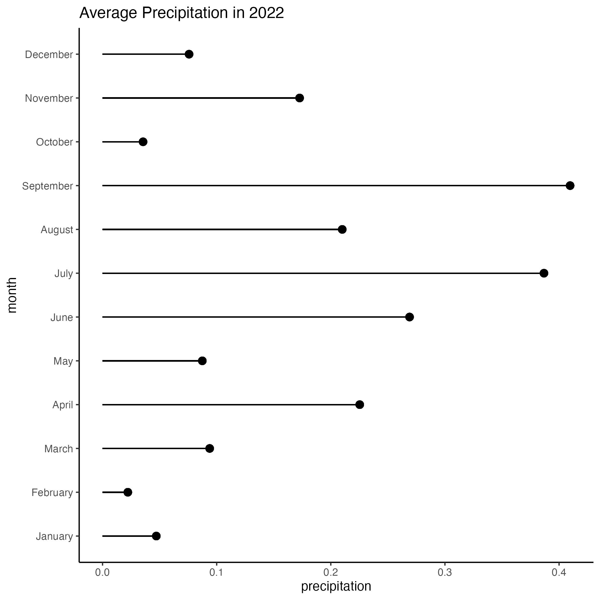
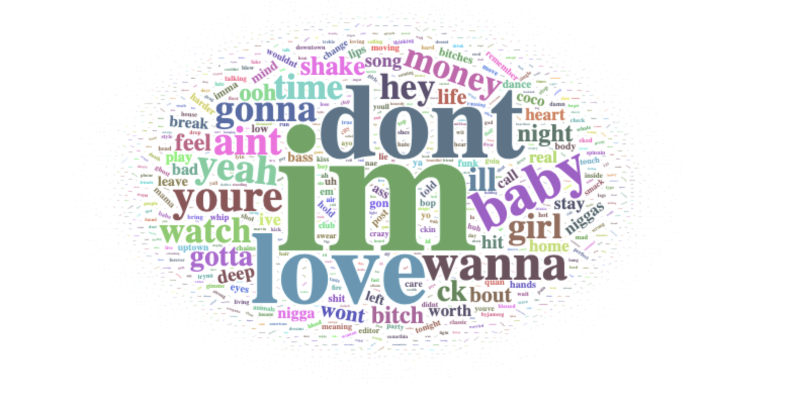

# Data Visualization Project 03

## PART 1: Density Plots

Using the dataset obtained from FSU's [Florida Climate Center](https://climatecenter.fsu.edu/climate-data-access-tools/downloadable-data), for a station at Tampa International Airport (TPA) for 2022, attempt to recreate the charts shown below which were generated using data from 2016. You can read the 2022 dataset using the code below:

``` r
library(tidyverse)
weather_tpa <- read_csv("https://raw.githubusercontent.com/reisanar/datasets/master/tpa_weather_2022.csv")
# random sample 
sample_n(weather_tpa, 4)
```

```         
## # A tibble: 4 × 7
##    year month   day precipitation max_temp min_temp ave_temp
##   <dbl> <dbl> <dbl>         <dbl>    <dbl>    <dbl>    <dbl>
## 1  2022     6    18          0          98       81     89.5
## 2  2022     4     3          0          80       68     74  
## 3  2022    12    20          0.11       67       58     62.5
## 4  2022     5    22          0          96       74     85
```


Using the 2022 data:

(a) Create a plot like the one below:


Hint: the option `binwidth = 3` was used with the `geom_histogram()` function.

```{r}
library(lubridate)
weather_tpa$month <- month(weather_tpa$month, label = T, abbr = F)
```

```{r}
ggplot(data=weather_tpa)+
  geom_histogram(aes(x=max_temp, fill=month),binwidth =3,,col=I("white"), show.legend = FALSE)+
  facet_wrap(~ month, nrow = 3, ncol = 4)+
  theme(legend.position="none")+
  scale_y_continuous(limits = c(0, 20))+
  scale_x_continuous(limits = c(60, 90))+
  ylab("Number of Days")+
  xlab("Maximum Temperature")+
  theme_bw()
```

 (b) Create a plot like the one below:


Hint: check the `kernel` parameter of the `geom_density()` function, and use `bw = 0.5`.

```{r}
density_plot<-ggplot(data=weather_tpa,aes(x=max_temp))+
  geom_density(bw = 0.5,kernel = "epanechnikov",color="black",fill="#7c7c7c")+
  theme(legend.position="none")+
  scale_x_continuous(limits = c(60, 90))+
  ylab("Number of Days")+
  xlab("Maximum Temperature")+
  theme_minimal()
```



(c) Create a plot like the one below:


Hint: default options for `geom_density()` were used.

```{r}
density_plot2022<-ggplot(data=weather_tpa,aes(x=max_temp,fill=month,col=I("black")))+
  geom_density(bw = 1,kernel = "epanechnikov", nrow =3, ncol = 4, alpha=.8)+
  facet_wrap(~ month)+  
  labs(x = "Maximum temperatures", y = " ", title = "Density plot for each month in 2022")+
  scale_x_continuous(limits = c(60, 90))+
  theme_bw()+
  theme(legend.position="none")
```



(d) Generate a plot like the chart below:


Hint: use the`{ggridges}` package, and the `geom_density_ridges()` function paying close attention to the `quantile_lines` and `quantiles` parameters. The plot above uses the `plasma` option (color scale) for the *viridis* palette.

```{r}
ridges <-ggplot(weather_tpa, aes(x = max_temp, y = month, fill = stat(x))) +
  geom_density_ridges_gradient(quantile_lines = TRUE, quantiles = c(0.5)) +
  scale_fill_viridis_c(name = "", option = "C") +
  theme_minimal()+
  labs(x = "Maximum temperature (in Fahrenheit degrees)",
       y = "")+
  theme_minimal()
```



(e) Create a plot of your choice that uses the attribute for precipitation *(values of -99.9 for temperature or -99.99 for precipitation represent missing data)*.

```{r}
weather_tpa <- weather_tpa %>%
  group_by(month) %>%
  mutate(
    avg_precipitation = mean(precipitation)
  ) 
```

```{r}
ggplot(data=weather_tpa, mapping = aes( x=month,y=avg_precipitation,fill=month)) +
   geom_pointrange(aes(ymin=0, ymax=avg_precipitation),show.legend =FALSE)+
  labs(y = "precipitation", title="Average Precipitation in 2022")+
  coord_flip()+
  theme_classic()
```



Since this dataset is for Tampa Florida I wanted to see if a lollipop chart can show how much it rains during summer/hurrican season. Here you can clearly see the average rain pick up during the summer and get worse a bit into hurricane seasonn

## PART 2

### Visualizing Text Data

Review the set of slides (and additional resources linked in it) for visualizing text data: <https://www.reisanar.com/slides/text-viz#1>

Using the billboard top 100 Lyrics I wanted to create a word map of the most used words based on the lyrics from Billboard Top 100  - [Billboard Top 100 Lyrics](https://github.com/reisanar/datasets/blob/master/BB_top100_2015.csv)

First I need read in the data and save it

```{r}
download.file("https://raw.githubusercontent.com/reisanar/datasets/master/BB_top100_2015.csv","billboard.csv")
```

```{r}
billboard<-read_csv("../data/billboard.csv")
```

For this visualization I want to make a word map using the lyrics to see which words are used the most in popular songs

```{r}
library(wordcloud2)
library(geniusr)
library(tidytext)
```

using the function `unnest_tokens` I was able to easily seperate the words from the lyrics column

```{r}
billboard<-billboard %>% 
  unnest_tokens(word, Lyrics)
```

After I seperated the words out I wanted to remove the stop words

```{r}
billboard<-billboard %>% 
  anti_join(stop_words)

```

now that I have my list of words I counted how many times each word appeard

```{r}
billboard <- billboard %>% 
  count(word, sort = TRUE)
```

`wordcloud2` made it easy to create a word cloud of the most used words. I set a seed to make sure the word cloud is reproducable.

```{r}
set.seed(1031)
wordcloud2(data=billboard)
```


